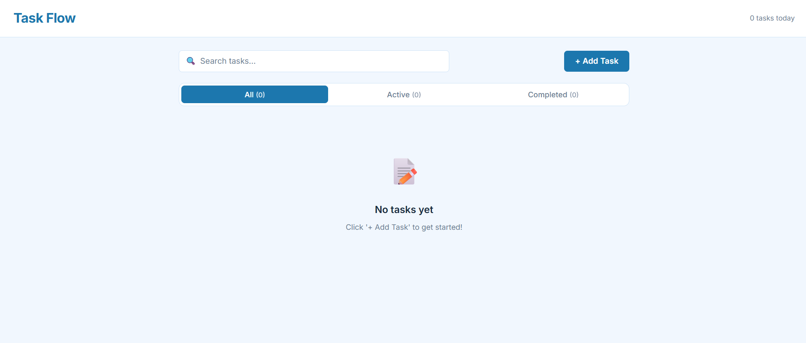

# Task Flow — Task Manager

A simple and elegant task manager web application built with Next.js.

## Live Demo

[https://task-manager-deltone.vercel.app/](https://task-manager-deltone.vercel.app/)


## Screenshot



## Tech Stack

- **Next.js 16** (App Router)
- **React 19**
- **Plain CSS** (no Tailwind, no CSS frameworks)
- **localStorage** for data persistence
- **Vercel** for deployment

## Features

- Create tasks with title and description
- Edit existing tasks with pre-filled modal form
- Delete tasks with confirmation prompt
- Toggle tasks between complete and incomplete states
- Search tasks by title and description (debounced)
- Filter tasks: All / Active / Completed with count badges
- Pagination (5 tasks per page)
- Form validation with character counters
- Responsive design (mobile, tablet, desktop)
- Data persists across browser refreshes via localStorage
- Skeleton loading state
- Custom 404 page

## How to Run Locally

1. **Clone the repository:**
   ```bash
   git clone https://github.com/AshenSachinthana/task-manager-deltone.git
   cd task-manager-deltone
   ```

2. **Install dependencies:**
   ```bash
   npm install
   ```

3. **Start the development server:**
   ```bash
   npm run dev
   ```

4. **Open your browser:**
   Navigate to [http://localhost:3000](http://localhost:3000)

## Architecture

Next.js App Router is used to demonstrate server/client component separation. All task state is managed client-side via localStorage, keeping the app fully static with no backend required.

### Project Structure

```
app/
  layout.js          — Root layout with Inter font and metadata
  page.js            — Home page (Server Component wrapper)
  loading.js         — Full-page loading skeleton
  not-found.js       — Custom 404 page
  globals.css        — Global styles, CSS variables, resets

components/
  TaskBoard.jsx      — Main client container, holds all state
  TaskForm.jsx       — Add new task modal/form
  TaskEditModal.jsx  — Edit existing task modal
  TaskItem.jsx       — Single task card
  TaskList.jsx       — Renders filtered/paginated task cards
  SearchBar.jsx      — Search input component
  FilterTabs.jsx     — All / Active / Completed tabs
  Pagination.jsx     — Pagination controls
  EmptyState.jsx     — Empty state messages
  Navbar.jsx         — App header

hooks/
  useTasks.js        — Task CRUD logic + localStorage sync
  usePagination.js   — Pagination logic
  useSearch.js       — Debounced search logic
```
